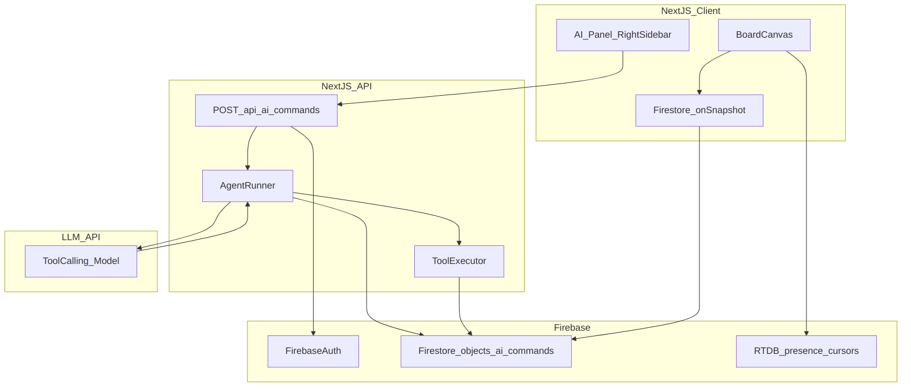

# MVP Architecture — Collaborative Whiteboard with AI Board Agent

## 1. High-Level System Overview

**Architecture style:**  
Serverless + managed realtime + SPA frontend.

**Core principle:**  
Let managed services handle realtime, auth, and scaling so the team can ship a stable multiplayer MVP quickly.

This document reflects the **Option A implementation**:
- No queue/worker tier
- No LangGraph
- AI orchestration runs in a Next.js API route

---

## 2. Final Tech Stack (Locked)

### Client
- Framework: Next.js (SPA-first usage)
- Rendering: React + Konva.js (or Fabric.js equivalent)
- State sync: Firestore realtime listeners (`onSnapshot`)
- Presence/cursors: Firebase Realtime Database
- Auth UI: Firebase Auth SDK
- **AI UX:** right-side chatbot-style panel on board page

### Backend (Serverless monolith)
- Platform: Next.js API routes (serverless functions)
- Primary endpoint: `POST /api/ai/commands`
- Responsibilities:
  - auth validation
  - prompt-to-tool orchestration
  - Zod argument validation
  - Firestore writes for board mutations and command history
  - basic rate limiting and logging

No microservices.  
No background queue for MVP.

### Realtime and database layer
**Primary database (board state): Firestore**
- stores board objects (sticky notes, shapes, frames, connectors, text/transforms)
- provides persistence after refresh and multi-user realtime sync

**Low-latency channel (presence/cursors): Realtime Database**
- stores online status and cursor positions
- uses `onDisconnect` for presence cleanup
- chosen for high-frequency lightweight updates

### Authentication
- Firebase Authentication
- Google login primary, email/password fallback
- MVP authorization: authenticated users can edit shared board

### AI model
- LLM API with tool/function-calling via serverless endpoint
- no embeddings, no vector DB, no background jobs for MVP

---

## 3. High-Level Architecture Diagram

---

## 4. AI Request Flow (Simple, No Queue)

1. User enters command in right-side AI panel.  
2. Client calls `POST /api/ai/commands` with:
   - `boardId`
   - `prompt`
   - `clientRequestId`
   - `selection` (optional)
   - `viewport` (optional)
3. API verifies Firebase token and board access.
4. API reads board objects from Firestore (`getBoardState`).
5. API calls LLM with:
   - system rules
   - user prompt
   - board state context
   - tool schema
6. LLM returns `tool_calls[]`.
7. API validates tool arguments with Zod.
8. API executes tool calls sequentially and writes results to Firestore (batched where possible).
9. API writes `ai_commands/{commandId}` status and summary.
10. API returns `{ commandId, status, summary }`.
11. All clients see board changes instantly through Firestore listeners.

---

## 5. Minimum Tool Schema (MVP)

- `createStickyNote(text, x, y, color)`
- `createShape(type, x, y, width, height, color)`
- `createFrame(title, x, y, width, height)`
- `createConnector(fromId, toId, style)`
- `moveObject(objectId, x, y)`
- `resizeObject(objectId, width, height)`
- `updateText(objectId, newText)`
- `changeColor(objectId, color)`
- `getBoardState()`

---

## 6. Required AI Command Coverage

### Creation
- add sticky note with text/color
- create shape with position/size/color
- add frame with title

### Manipulation
- move objects
- resize objects
- change color / update text

### Layout
- arrange elements in grid
- space elements evenly

### Complex multi-step
- SWOT template (four quadrants)
- user journey map (five stages)
- retrospective board (three columns)

---

## 7. Firestore and RTDB Data Model

### Existing
- `boards/{boardId}/objects/{objectId}`

### New for AI history
- `boards/{boardId}/ai_commands/{commandId}`
  - `prompt`
  - `actor`
  - `status` (`running | completed | failed`)
  - `createdAt`
  - `updatedAt`
  - `summary`
  - `idempotencyKey`
  - `clientRequestId`
  - `error` (optional)

### Presence/cursors (unchanged)
- RTDB for online status and cursor x/y streams

---

## 8. Concurrency, Reliability, and Safety

- Use `clientRequestId` + `idempotencyKey` to reduce duplicate execution.
- Apply object-level `updatedAt`/`version` checks where available.
- MVP conflict rule: last-write-wins.
- Execute multi-step plans sequentially; stop on failed validation/execution.
- Return partial failure summary in `ai_commands`.
- Enforce tool allowlist and strict Zod schemas.
- Apply basic per-user rate limiting.

---

## 9. How This Architecture Meets MVP Requirements

### Real-time collaboration
- shared board mutations stored in Firestore
- all users receive updates via realtime listeners
- cursors/presence via RTDB

### AI agent behavior
- natural-language command input in right-side AI panel
- tool-call planning and execution in serverless API
- multi-step command execution supported in a single request lifecycle

### Performance and delivery
- target `<2s` for typical single-step commands
- low ops overhead and fast implementation because no queue/worker tier

---

## 10. Deployment and Cost

- Hosting: Vercel or Firebase Hosting (either acceptable)
- CI/CD: git push auto deploy + baseline lint/test
- Cost profile: mostly free-tier Firebase + LLM token costs

---

## 11. Final Architecture Summary (Submission-Ready)

The MVP uses a serverless, SPA-first architecture built with Next.js on the frontend and Firebase for authentication, realtime synchronization, and persistence. Firestore stores board objects and AI command history, while Realtime Database handles low-latency cursor and presence updates. A serverless API endpoint (`POST /api/ai/commands`) integrates LLM tool-calling, validates tool inputs, executes board operations, and writes results to Firestore so all users see AI-generated changes in real time. This architecture intentionally avoids queue/worker complexity for the MVP while still supporting multi-step AI commands and collaborative consistency.
